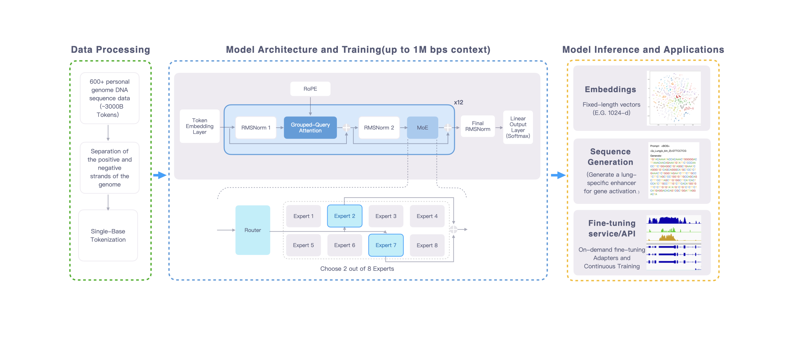

# Genos: Genomic Foundation Model

<p align="center">
  English | <a href="README_zh.md">中文</a>
</p>


Genos is a human-centric genomic foundation model trained on high-quality, chromosome-scale de novo assemblies from publicly available resources such as HPRC and HGSVC, representing diverse global populations. Genos supports million–base-pair context modeling at single-nucleotide resolution using a hybrid Mixture-of-Experts (MoE) architecture. The current release includes 1.2B and 10B parameter versions, optimized for variant interpretation, regulatory element prediction, and functional genome analysis.  


→ Learn more in the <a href="Documents/README.md">document</a>.
## Contents


- [Genos: Genomic Foundation Model](#genosgenomicfoundationmodel)
  - [Contents](#contents)
  - [Setup](#setup)
    - [Requirements](#requirements)
    - [Installation](#installation)
    - [Docker](#docker)
  - [Usage](#usage)
    - [Checkpoints](#checkpoints)
    - [Forward](#forward)
    - [Embeddings](#embeddings)
    - [Generation](#generation)
  - [Notebooks](#notebooks)
  - [Training](#training)
  - [Performance](#performance)
    - [Benchmarking](#benchmarking)
  - [Citation](#citation)
  - [License](#license)
  - [Contact](#contact)
  
---

## Setup

### Requirements
- Python ≥ 3.9
- PyTorch ≥ 2.0
- Transformers (Hugging Face) or custom Genos-compatible inference library
- CUDA-compatible GPU (recommended: H100/A100 for 10B model)
- `wandb` (optional, for logging during fine-tuning)

> *Note: Exact dependency versions are pending final release.*

### Installation
```bash
# TODO: Add installation command once package is published
# e.g., pip install genos
```

### Docker
```bash
# TODO: Add Docker pull command
# e.g., docker pull genomics/genos:latest
```

---

## Usage

### Checkpoints
Pretrained model checkpoints are available for research use:

| Model Name        | Parameters | Huggingface ckpt | Megatron ckpt |
|-------------------|------------|----------------|---------------|
| `Genos-1.2B`  | 1.2B       |  [Genos-1.2B](https://huggingface.co/BGI-HangzhouAI/Genos-1.2B) |  [Genos-1.2B](https://huggingface.co/BGI-HangzhouAI/Genos-Megatron-1.2B) |
| `Genos-10B`       | 10B        |  [Genos-10B](https://huggingface.co/BGI-HangzhouAI/Genos-10B)   |  [Genos-10B](https://huggingface.co/BGI-HangzhouAI/Genos-Megatron-10B)   |


> Both models use a hybrid Mixture-of-Experts (MoE) architecture and support single-nucleotide resolution.

### Forward
Run a forward pass to obtain hidden states:
```python
# TODO: Add minimal forward example
```

### Embeddings
Generate sequence embeddings for downstream tasks (e.g., variant effect prediction, regulatory element detection):
```python
# TODO: Add embedding extraction example
```

### Generation
Genos supports conditional generation tasks such as RNA-seq coverage prediction from DNA input (see [Case 1](Documents/README.md#case-1-rna-seq-data-generation)).

Example fine-tuning head for transcriptome prediction:
- Input: 32K bp DNA sequence
- Output: Single-base RNA expression profile (logits → scaled via Softplus)
- Loss: MSE (default), Poisson, Tweedie supported

> Full training script and data preprocessing pipeline available in internal repo.

---

## Notebooks
We provide example Jupyter notebooks for:
- Variant effect prediction
- Regulatory element annotation
- RNA-seq track generation

🔗 *Notebook links:待补充*

---

## Training
Genos was pretrained on >1,500B tokens from diverse, high-quality human genomes (HPRC, HGSVC). Fine-tuning examples include:

- **Task**: RNA-seq coverage prediction
- **Data**: ENCODE + GTEx (667 samples, cell-type normalized)
- **Architecture**: Base Genos + 3-layer CNN head
- **Hardware**: 8×H100 (64 GPUs), bf16 precision
- **Training**: 1 epoch, LR=5e-5, cosine scheduler

See [Document](Documents/README.md#case-1-rna-seq-data-generation) for full training config.

---

## Performance

### Benchmarking


## Citation
If you use Genos in your research, please cite:

```bibtex
@article{Genos2025,
  title={Genos: A Human-Centric Genomic Foundation Model},
  author={Genos team，Hangzhou，China},
  journal={Preprint},
  year={2025}
}
```

> *Fake link, final citation format pending publication.*

---

## License
MIT License. See [LICENSE](LICENSE) for details.

## Contact
For questions or collaboration: **bgi-Genos@genomics.cn**

