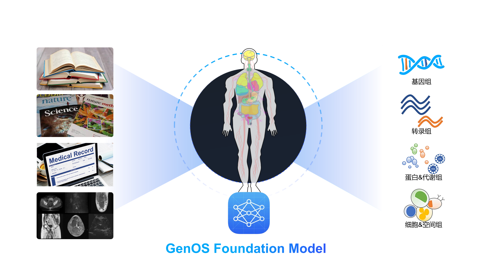

# Genos: Genomic Foundation Model

  English | <a href="README_zh.md">中文</a>

Genos is a human-centric genomic foundation model trained on high-quality, chromosome-scale de novo assemblies from publicly available resources such as HPRC and HGSVC, representing diverse global populations. Genos supports million–base-pair context modeling at single-nucleotide resolution using a hybrid Mixture-of-Experts (MoE) architecture. The current release includes 1.2B and 10B parameter versions, optimized for variant interpretation, regulatory element prediction, and functional genome analysis.
→ Learn more in the <a href="Documents/README.md">document</a>.
## Contents

- [Genos: Genomic Foundation Model](#genosgenomicfoundationmodel)
  - [Contents](#contents)
  - [Setup](#setup)
    - [Requirements](#requirements)
    - [Installation](#installation)
    - [Docker](#docker)
  - [Usage](#usage)
    - [Checkpoints](#checkpoints)
    - [Forward](#forward)
    - [Embeddings](#embeddings)
    - [Generation](#generation)
  - [Notebooks](#notebooks)
  - [Training](#training)
  - [Citation](#citation)
  
## Setup

### Requirements

### Installation

### Docker

## Usage

### Checkpoints

### Forward

### Embeddings

### Generation

## Notebooks
We provide example notebooks.

## Training

## Citation