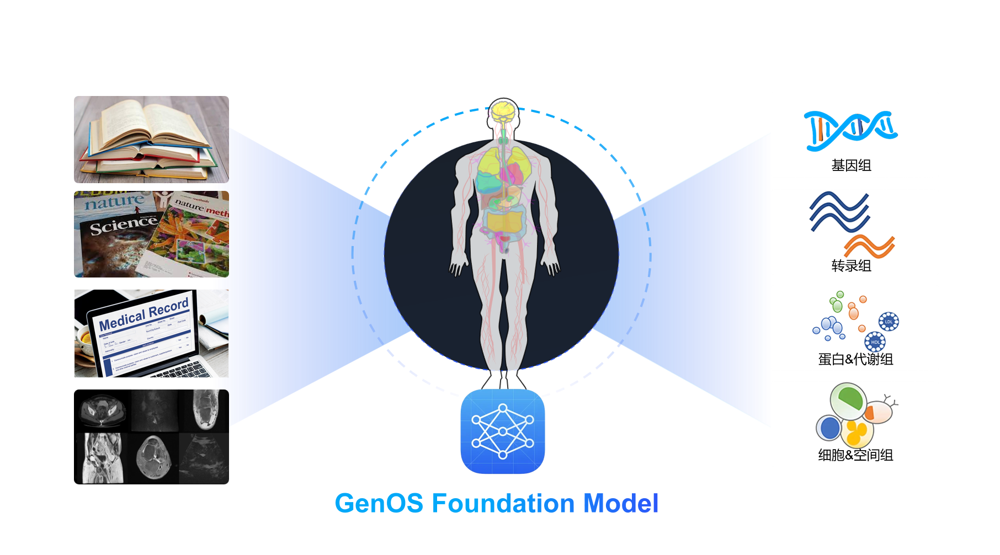

# Genos：人类基因组基础模型

  <a href="README.md">English</a> | 中文

**Genos** 是一个以人类基因组为核心的基础模型，基于高质量、染色体级的 *de novo* 组装数据进行训练，数据来源包括 **HPRC** 和 **HGSVC** 等公开资源，覆盖多样的全球人群。
Genos 具备百万碱基级的上下文建模能力，并在单碱基分辨率下学习基因组的结构与调控规律。模型采用混合专家 (**Mixture-of-Experts, MoE**) 架构，目前发布 **1.2B** 与 **10B** 参数版本，针对变异解析、调控元件预测及功能基因组学分析进行了优化。
→ 了解更多，请访问 <a href="Documents/README.md">详细文档</a>。

## 目录

- [Genos：人类基因组基础模型](#genos人类基因组基础模型)
  - [目录](#目录)
  - [环境配置](#环境配置)
    - [依赖要求](#依赖要求)
    - [安装](#安装)
    - [Docker](#docker)
  - [使用方法](#使用方法)
    - [模型检查点](#模型检查点)
    - [前向推理](#前向推理)
    - [Embedding 提取](#embedding-提取)
    - [序列生成](#序列生成)
  - [示例笔记本](#示例笔记本)
  - [模型训练](#模型训练)
  - [引用](#引用)

## 环境配置

### 依赖要求

### 安装

### Docker

## 使用方法

### 模型检查点

### 前向推理

### Embedding 提取

### 序列生成

## 示例笔记本

我们提供了示例 Jupyter Notebook，用于演示 Genos 的加载、推理与分析流程。

## 模型训练

## 引用

